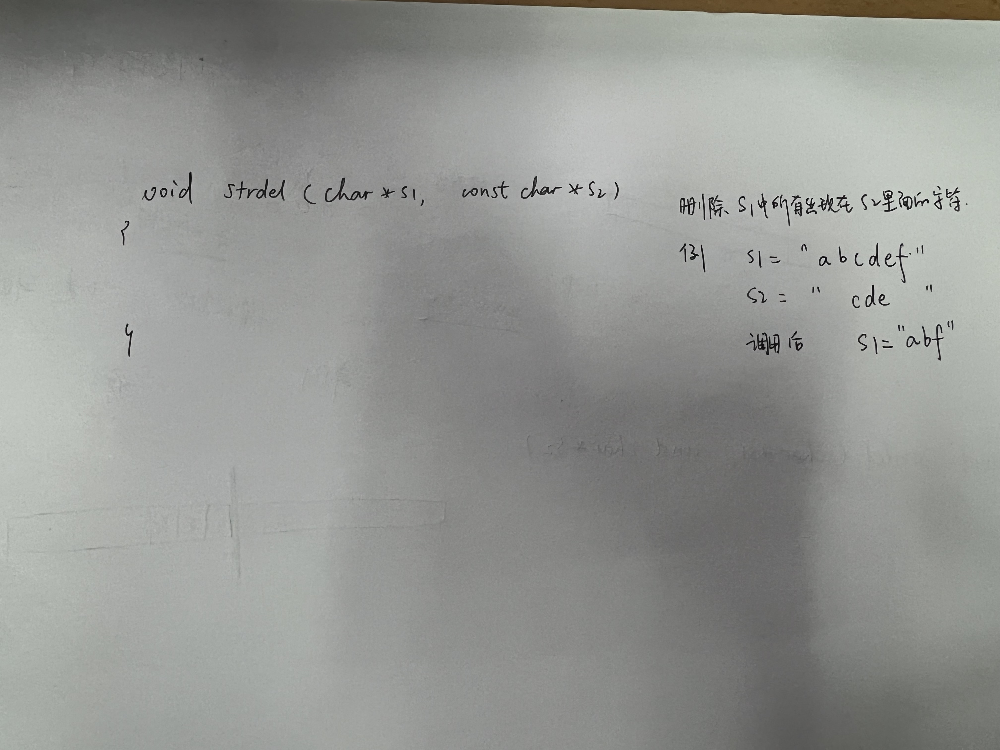

# 3_25 商汤 ｜ 岗位：高性能kernel

<<<<<<< HEAD
张程

## 算法题

1. 两个栈实现一个队列

2. easy题 

## 八股

1. fma
2. cpu5级流水
3. 如何发挥处理器的性能
4. dma怎么传输
5. 是否写过高性能gemm，如何写
6. 单例模式
7. 处理器的峰值性能多少

## 杂项
国防科大面试官->知道mt3000 是matrix3000

现场口算xx最高吞吐率：16个vpe依次执行32个单精度浮点